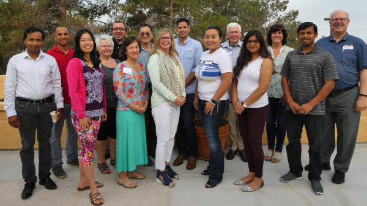

---
# Feel free to add content and custom Front Matter to this file.
# To modify the layout, see https://jekyllrb.com/docs/themes/#overriding-theme-defaults

layout: home
---

Rancho Bernardo (RB) Toastmasters is one of San Diego's leading clubs. Our members are largely from the local San Diego communities around Rancho Bernardo and the cities of Poway and Escondido. We are a diverse and welcoming club with members of all ages, professions, speaking abilities and many different nationalities

### Meeting Time:

Every Thursday , 7:00 am to 8:30 am. 
_Please arrive 5 minutes early_

### Address:

Second Floor 
The Gateway 
12751 Gateway Park Road 
Poway, CA 92064 

<iframe frameborder="0" height="350" marginheight="0" marginwidth="0" scrolling="no" src="https://maps.google.com/maps?f=q&amp;source=s_q&amp;hl=en&amp;geocode=&amp;q=Rancho+Bernardo+Toastmasters,+Gateway+Park+Road,+Poway,+CA&amp;aq=0&amp;sll=37.0625,-95.677068&amp;sspn=33.489543,86.572266&amp;ie=UTF8&amp;hq=Rancho+Bernardo+Toastmasters,&amp;hnear=Gateway+Park+Rd,+Poway,+San+Diego,+California+92064&amp;ll=32.999453,-117.056499&amp;spn=0.006295,0.006295&amp;t=h&amp;output=embed" width="100%"></iframe>
 
<a href="https://maps.google.com/maps?f=q&amp;source=embed&amp;hl=en&amp;geocode=&amp;q=Rancho+Bernardo+Toastmasters,+Gateway+Park+Road,+Poway,+CA&amp;aq=0&amp;sll=37.0625,-95.677068&amp;sspn=33.489543,86.572266&amp;ie=UTF8&amp;hq=Rancho+Bernardo+Toastmasters,&amp;hnear=Gateway+Park+Rd,+Poway,+San+Diego,+California+92064&amp;ll=32.999453,-117.056499&amp;spn=0.006295,0.006295&amp;t=h" style="color: #0000FF; text-align: left">View Larger Map</a>

